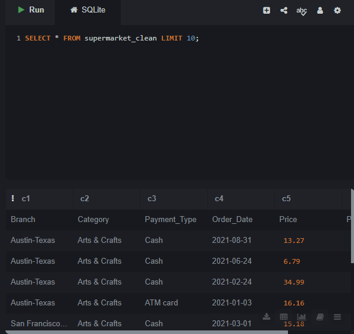
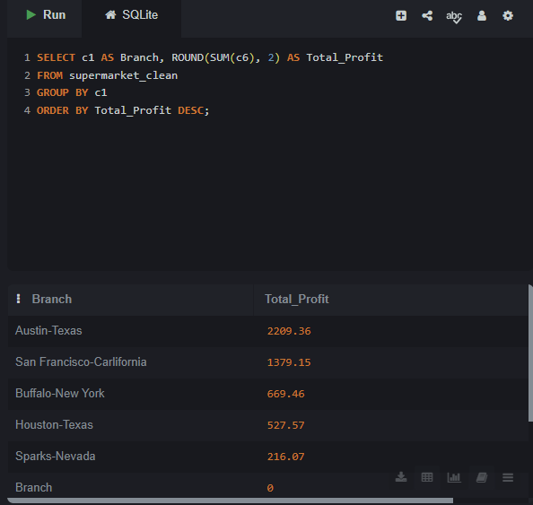
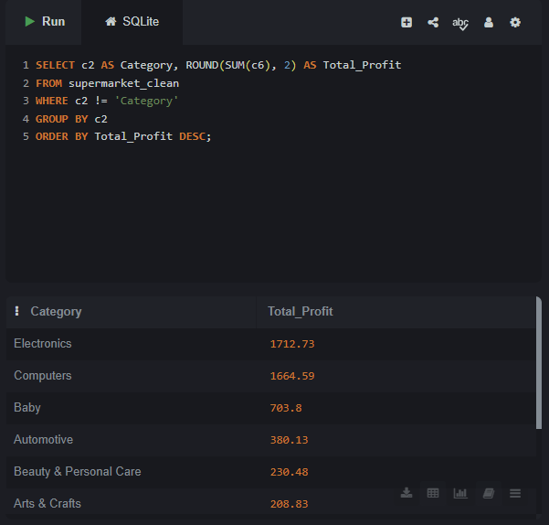
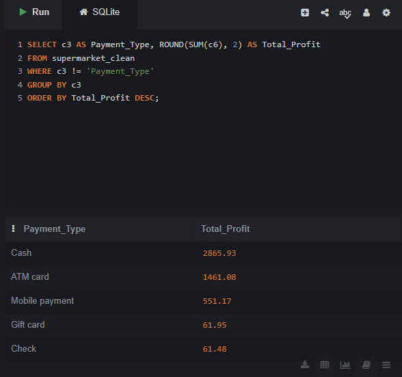
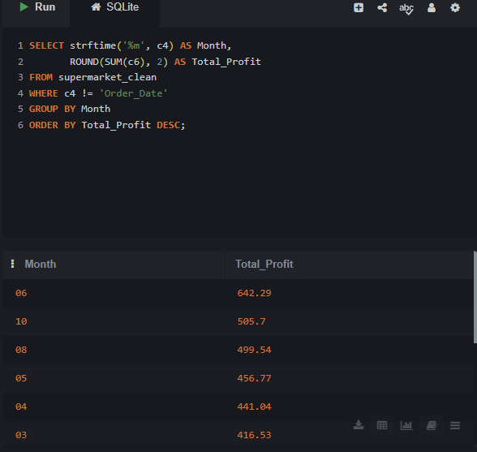

# Supermarket Sales SQL Analysis

## Problem
Analyze real supermarket sales data to identify top performing 
branches, most profitable categories, preferred payment methods,
and best selling months.

## Dataset
- Source: Kaggle - Supermarket Sales Dataset
- 1,000 real sales records
- Branches: Austin-Texas, San Francisco-California, 
  Buffalo-New York, Houston-Texas, Sparks-Nevada
- Period: 2021
- Columns: Branch, Category, Payment Type, Order Date, Price, Profit

## Tool Used
- SQL (SQLite)

## Key Findings
- Total Profit: $5,001.61
- Best Branch: Austin-Texas with $2,209.36
- Best Category: Electronics with $1,712.73
- Most Used Payment: Cash with $2,865.93
- Best Month: June (06) with $642.29

## Decision & Recommendations
- Invest more in Austin-Texas as it is the top performer
- Focus on Electronics as it drives most profit
- Encourage Cash payments as they dominate transactions
- Plan promotions in June as it is the best month
- Review Sparks-Nevada branch strategy urgently

## Analysis Steps & Results

### Step 1: Sample Data

### Step 2: Total Profit by Branch

### Step 3: Total Profit by Category

### Step 4: Total Profit by Payment Type

### Step 5: Total Profit by Month

## Files
- supermarket_sql_analysis.sql : All SQL queries
- supermarket_clean.csv : Dataset used
